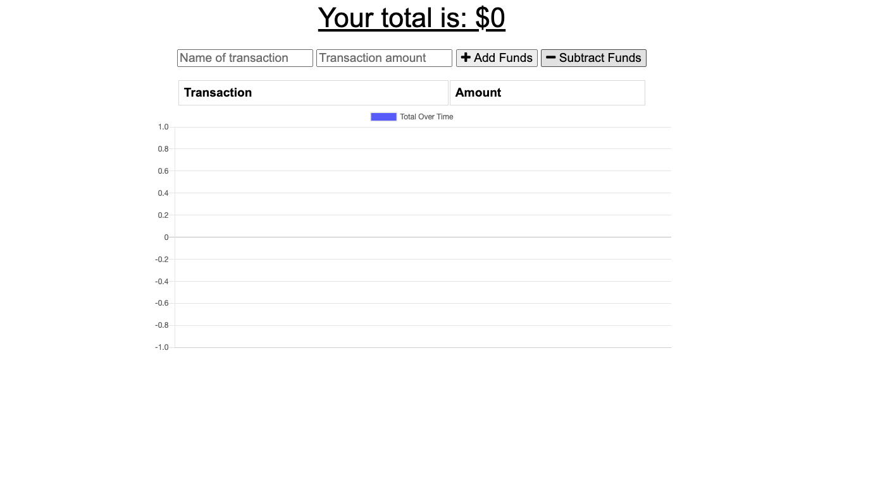
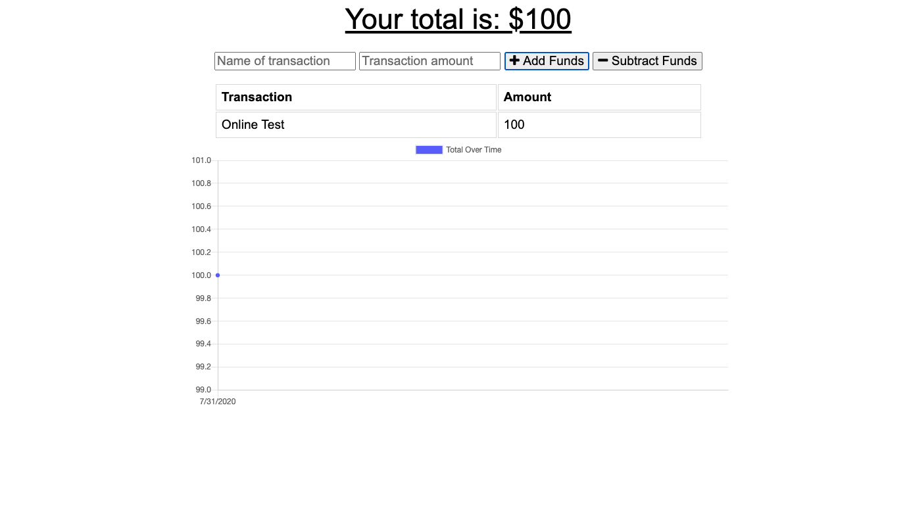
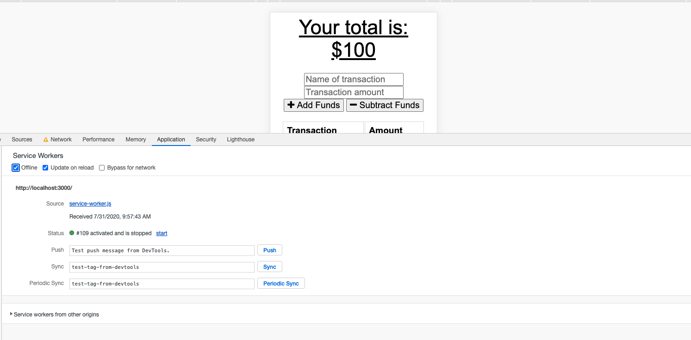
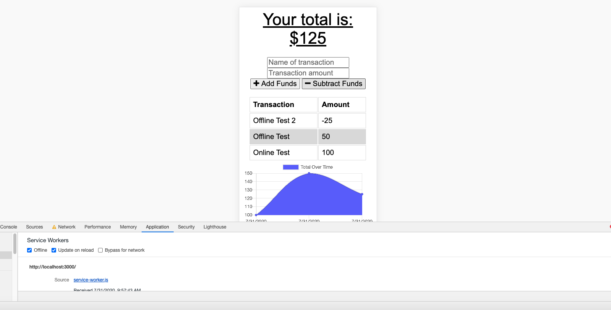
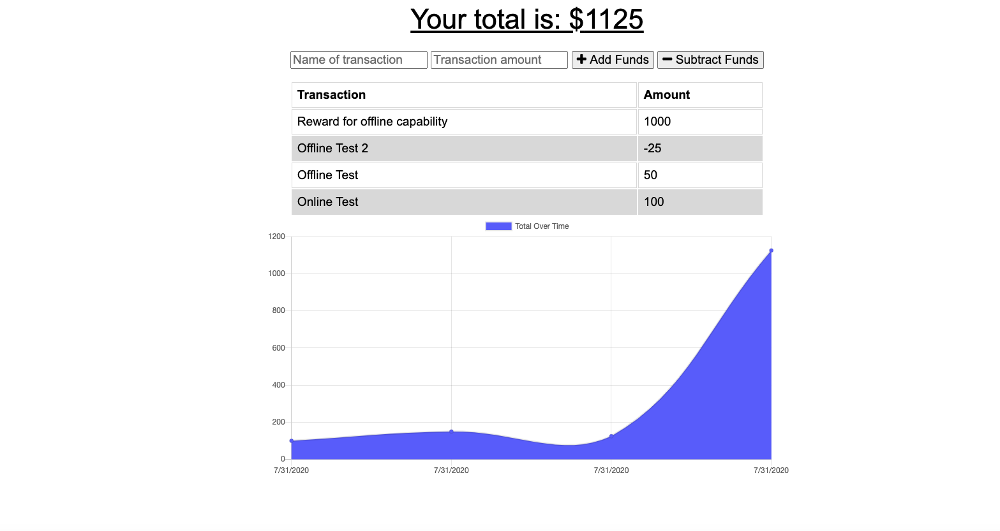

  # Budget Tracker

  

  ## Description

    In a perfect world, a user would have perfect connectivity on all their devices. However, in the event connectivity is lost, maintaining functionality becomes a huge asset. The Budget Tracker application is designed to allow the user to add/subract funds regardless of their network connection, and not miss a beat. 

    Utilizing indexedDB in addition to MongoDB and mongoose, any transactions made offline will store as pending in the database, ensuring to update once connectivity is achieved.

  ## Table of Contents

  * [Installation](#installation)

  * [Usage](#usage)

  * [License](#license)

  * [Contributing](#contributing)

  * [Tests](#tests)

  * [Questions](#questions)

  ## Installation
  To install the necessary dependencies, run the following command:
  
  npm i

  ## Usage
  
  [Deployed Link](https://budget-tracker-27.herokuapp.com/)

  ## License

  This project is not licensed

  ## Contributing

  [Joshua Homer](https://github.com/Jchomer90)

### Update you budget with any transaction made, if made offline the total will update once online

  ## Questions
  If you have any questions about the repository, open an issue or contact me directly at Joshuachomer@gmail.com.
   You can also find more of my work on [Github](www.github.com/Jchomer90)
  # Budget-Tracker